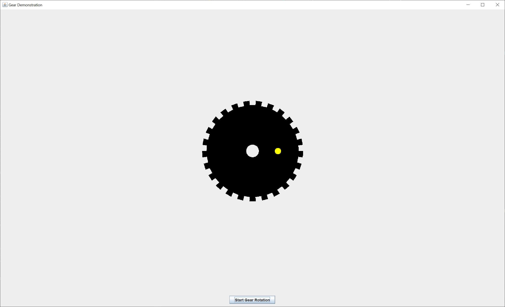
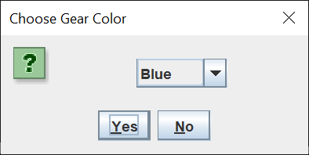
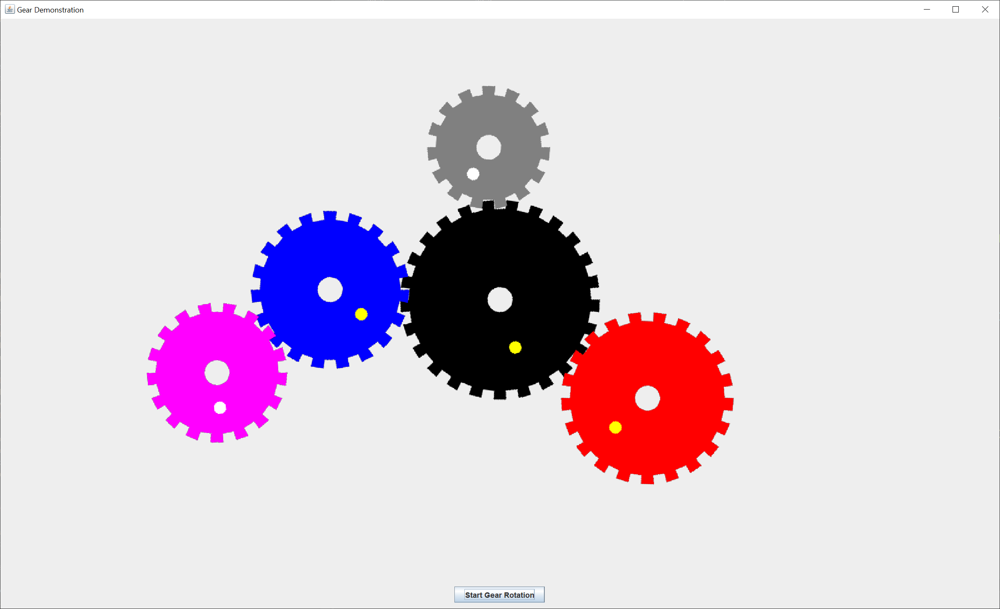

# Gear Demonstration

## Introduction

Recently on Stack Overflow, a stgudent posted abouit his project to create a [gear simulator](https://stackoverflow.com/questions/75462877/how-to-rotate-images-every-tick#comment133147815_75462877).  It sounded like a good idea for a project, so I decided to give it a try.

Here's the GUI I came up with.  The gear demonstration starts with one gear in the center of the drawing panel.

The spot on the gear is there to help you see the gear when it's rotating.

To add a gear, you click the left mouse button on a blank portion of the drawing panel near an existing gear, drag the mouse to an existing gear, and release the left mouse button.  A new gear may only be attached to one other gear.

When you add a new gear, a dialog will pop up asking you for the color of the new gear.  You can choose a color and left-click the "Yes" button to make the new gear that color.  If you left-click the "No" button, the gear will be black.

To remove a gear, you click the right mouse button on the existing gear and release the right mouse button.  You may not remove the original gear.  To remove all the gears, except the original gear, click the right mouse button on a blank portion of the drawing panel.

The gear teeth don't always mesh together.  I couldn't figure out how to adjust the new gear to make the teeth mesh.  You can delete the new gear and try again if you want to improve the meshing.

Once you've placed all your gears, left-click on the "Start Gear Rotation" button at the bottom of the frame.  The original gear will rotate clockwise.  The other gears will rotate counterclockwise or clockwise, depending on which gear they are connected to.  You can stop the gear rotation by left-clicking on the "Stop Gear Rotation" button at the bottom of the frame.

Here's what the GUI looks like after I've added a few gears and rotated them.

The magenta and black gears rotate clockwise, while the other colored gears rotate counterclockwise.

You can maximize the frame and drawing panel, but the original gear will remain in its original position.

## Explantion

Oracle has a helpful tutorial, [Creating a GUI With Swing](https://docs.oracle.com/javase/tutorial/uiswing/index.html).  Skip the Learning Swing with the NetBeans IDE section. 

When I create a Swing application, I use the [model-view-controller](https://en.wikipedia.org/wiki/Model%E2%80%93view%E2%80%93controller) (MVC) pattern.  This pattern allows me to separate my concerns and focus on one part of the Swing application at a time.

The MVC pattern implies that you create the model first, then the view, then finally the controllers.  I could not have created this Swing application without creating a robust data model first.

- A Swing model consists of one or more plain Java getter/setter classes.
- A Swing view consists of one `JFrame` and as many `JPanels` and `JDialogs` as needed.
- A Swing controller consists of as many `Actions` and `Listeners` as needed.  Each `Action` and `Listener` is responsible for modifying its part of the model and updating its part of the view.

I created this Swing application by coding small parts and running lots of tests.  I create enough of the GUI to run an integration test, then run the test.  As I add to the GUI, I run more integration tests.  I ran somewhere between 500 and 750 separate integration tests of this application.

**Code a little, test a lot.**

### Model

I wrote three model classes for this application. 

The `ColorPair` class holds a `String` with the gear color name, a `Color` gear color, and a `Color` spot color.  An array of `ColorPair` instances is loaded into the dialog combo box.

The `Gear` class holds a `double` outer radius of the gear, a `boolean` clockwise/counterclockwise flag, a `Color` gear color, and a `Color` spot color.  Calculated values include a `double` display angle in degrees, a `double` inner radius, a `double` tooth arc, a `BufferedImage` image, and an `int` number of teeth.

The difference between the outer radius and the inner radius is the tooth depth.  The tooth arc measures the tooth width, as well as the tooth gap, in degrees.

The image is created based on the input and calculated values.  The drawing panel will rotate this image display angle degrees and draw the image.  The image is rectangular, so the non-gear portion of the image is filled with a transparent color.

The `GearDemoModel` class is the main model class.  The class holds an array of `ColorPair` instances, a drawing area `Dimension`, and a `java.util.List` of `Gear` instances.  The drawing area dimension is defined here so the origianl gear can be placed in the center of the drawing area.

### View

I created a `JFrame`, a drawing `JPanel`, a control `JPanel`, and a gear color `JOptionPane`.

The `JFrame` uses a default `BorderLayout`.  The drawing `JPanel` is placed in the CENTER, and the control `JPanel` is placed in the SOUTH.

The drawing `JPanel` extends `JPanel` and overrides the `paintComponent` method.  My `paintComponent` method calls the `JPanel` `paintComponent` method using `super` first to maintain the Swing paint chain.  Each gear image is rotated display angle degrees and drawn on the drawing `JPanel`.  I use a `AffineTransform` to rotate each gear image.

The control `JPanel` holds the "Start Gear Rotation" `JButton`.  When the animation is running, the text is changed to "Stop Gear Rotation".

The gear color `JOptionPane` holds a `JComboBox` `JPanel` with the array of `ColorPair` instances.

## Controller

I created three controller classes.

The `ButtonListener` class starts and stops the animation Swing `Timer`.

The `GearListener` is a `MouseListener` (`MouseAdapter`) that listens for mouse presses and releases on the drawing panel.  This class creates new gears, deletes new gears, and deletes all new gears, depending on where you click in the drawing panel and which mouse button you click.

The `RotateGearsListener` class adjusts the drawing angle of all of the gears and repaints the drawing panel.  This class is called 40 times a second by the Swing `Timer` to provide the gear animation.
